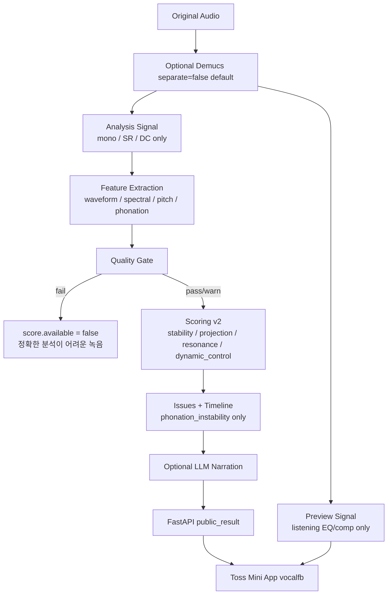

# Architecture (VAgent v2)

## Pipeline

## Principles

- Deterministic score first; LLM never computes scores.
- Melody F0 movement ≠ phonation instability.
- UNKNOWN confidence never becomes strength.
- Quality FAIL ≠ skill score 0.
- Analysis path must not use preview EQ.
